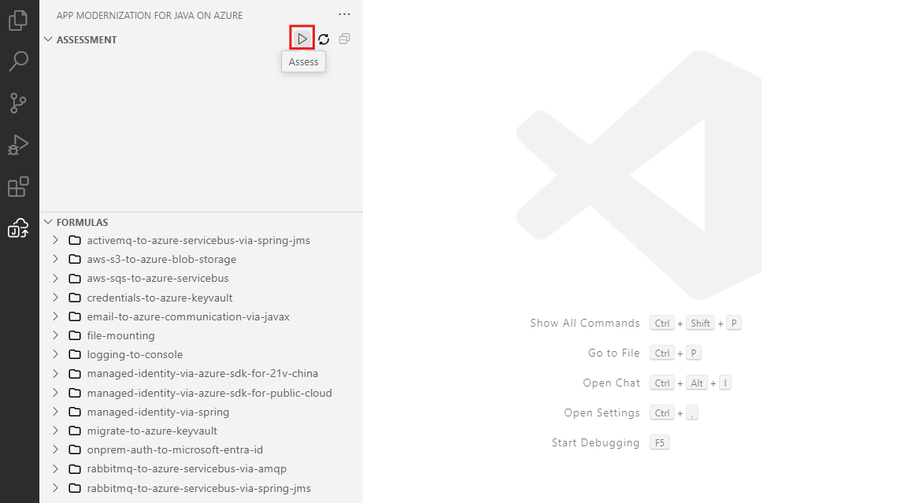
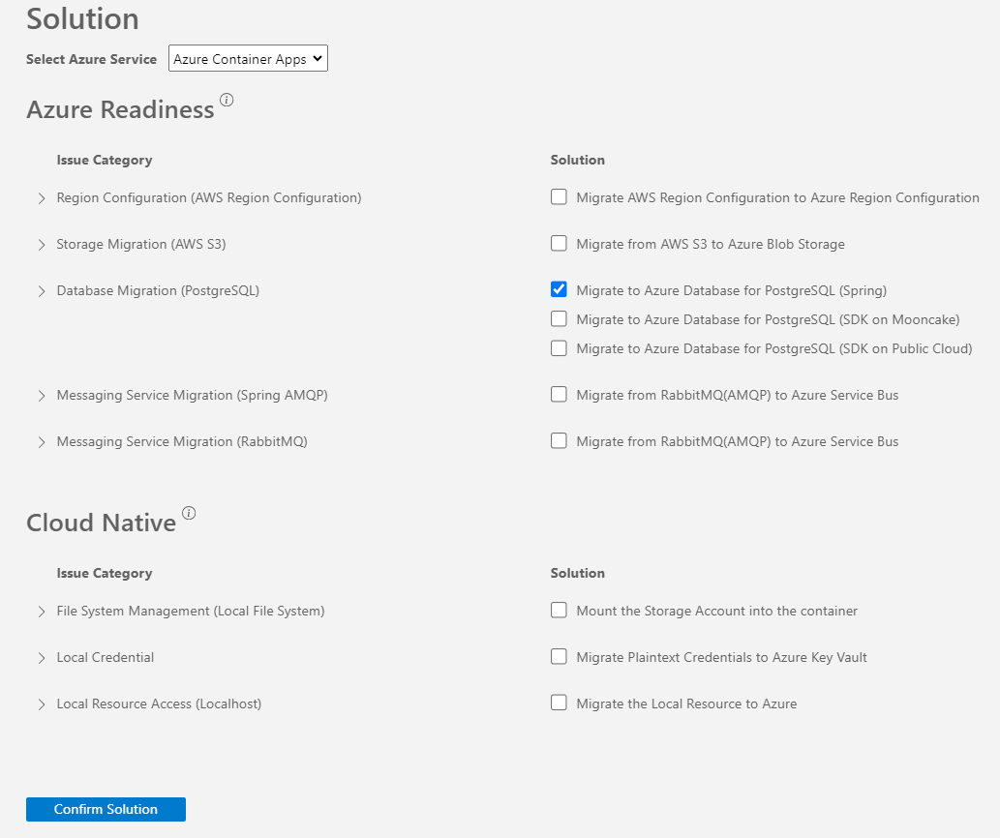
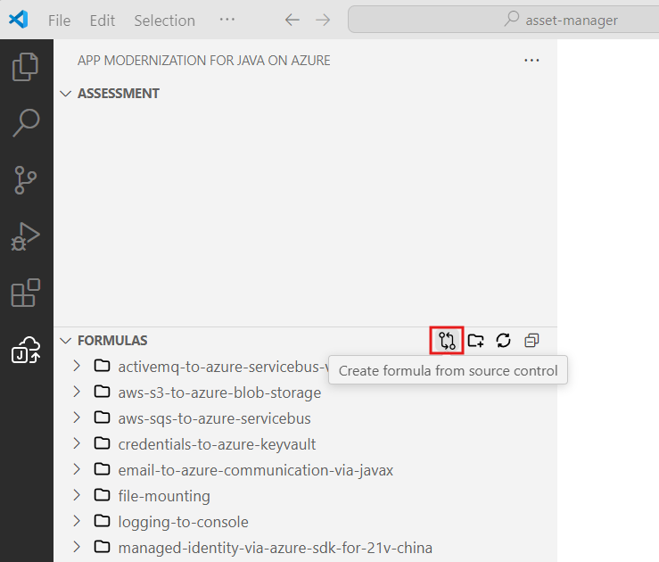
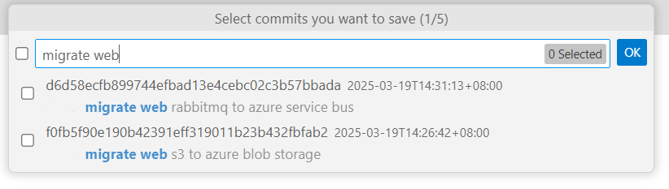
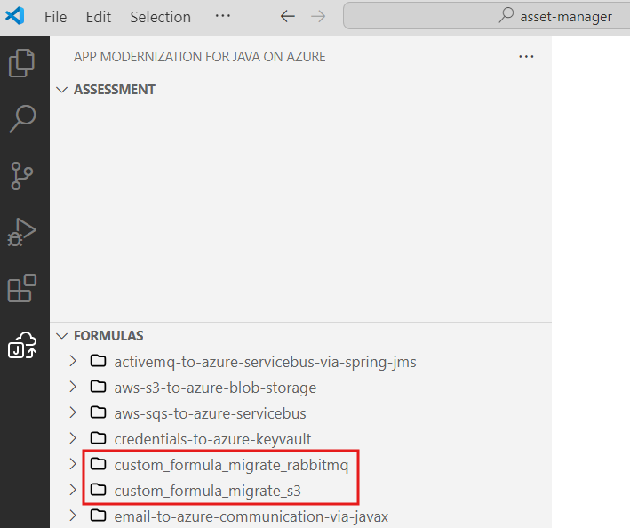
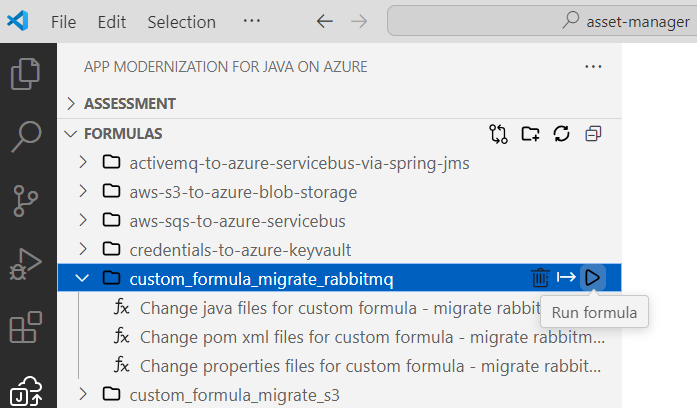
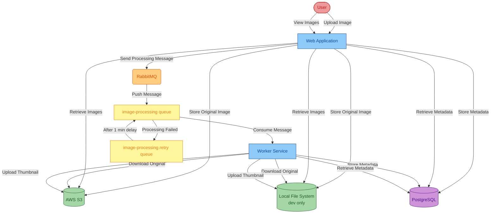
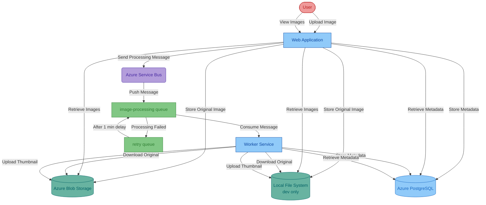

# Workshop: migrate this project to Azure

> [!IMPORTANT]
> `GitHub Copilot App Modernization for Java` is in preview and is subject to change before becoming generally available.

GitHub Copilot App Modernization for Java (Preview), also referred to as `App Modernization for Java`, assists with app assessment, planning and code remediation. It automates repetitive tasks, boosting developer confidence and speeding up the Azure migration and ongoing optimization.

In this workshop, you learn how to use GitHub Copilot App Modernization for Java (Preview) to assess and migrate a sample Java application `asset-manager` to Azure. This application consists of two sub-modules, **Web** and **Worker**. For more information about this sample application, see [Asset Manager](README.md).

## Prerequisites

To successfully complete this workshop, you need the following:

- [VSCode](https://code.visualstudio.com/): The latest version is recommended.
- [A Github account with Github Copilot enabled](https://github.com/features/copilot): All plans are supported, including the Free plan.
- [GitHub Copilot extension in VSCode](https://code.visualstudio.com/docs/copilot/overview): The latest version is recommended.
- [AppCAT](https://aka.ms/appcat-install): Required for the app assessment feature.
- [JDK 21](https://learn.microsoft.com/en-us/java/openjdk/download#openjdk-21): Required for the code remediation feature and running the initial application locally.
- [Maven 3.9.9](https://maven.apache.org/install.html): Required for the assessment and code remediation feature.
- [Azure subscription](https://azure.microsoft.com/free/): Required to deploy the migrated application to Azure.
- [Azure CLI](https://docs.microsoft.com/cli/azure/install-azure-cli): Required if you deploy the migrated application to Azure locally. The latest version is recommended.
- Fork the [GitHub repository](https://github.com/Azure-Samples/java-migration-copilot-samples) that contains the sample Java application. Please ensure to **uncheck** the default selection "Copy the `main` branch only". Clone it to your local machine. Open the `asset-manager` folder in VSCode and checkout the `main` branch.

## Install GitHub Copilot App Modernization for Java (Preview)

In VSCode, open the Extensions view from Activity Bar, search `GitHub Copilot App Modernization for Java` extension in marketplace. Select the Install button on the extension. After installation completes, you should see a notification in the bottom-right corner of VSCode confirming success.

In VSCode, configure runtime arguments to enable the proposed API:
```json
  "enable-proposed-api": ["Microsoft.migrate-java-to-azure"],
```
1. Press **Ctrl+Shift+P** and select **Preferences: Configure Runtime Arguments**.
2. Add the above JSON snippet into the editor and save.
3. Restart VSCode.


## Migrate the Sample Java Application

The following sections guide you through the process of migrating the sample Java application `asset-manager` to Azure using GitHub Copilot App Modernization for Java (Preview).

### Assess Your Java Application

The first step is to assess the sample Java application `asset-manager`. The assessment provides insights into the application's readiness for migration to Azure.

1. Open the VS code with all the prerequisites installed on the asset manager by changing the directory to the `asset-manager` directory and running `code .` in that directory.
1. Open the extension `App Modernization for Java`.
1. Hover the mouse over the **Assessment** section and click **Assess** button which looks like a triangle pointing right. Then, the Github Copilot Chat window will be opened and propose to run Modernization Assessor. Please confirm the tool usage by clicking **Continue**. 


   > **NOTE**: If you are asked to allow the tool access the language models provided by GitHub Copilot Chat, select **Allow** to proceed.

1. After each step, please manually input "continue" to confirm and proceed.
1. Wait for the assessment to be completed and the report to be generated.
1. Review the **Summary** report. Select **Propose Solution** to view the proposed solutions for the issues identified in the summary report.
1. For this workshop, deselect all solutions and select **Migrate to Azure Database for PostgreSQL (SDK on Public Cloud)** in the Solution report, then select **Confirm Solution**.

1. In the Migrate report, click **Migrate**.

### Migrate to Azure Database for PostgreSQL Flexible Server using Predefined Formula

1. After clicking the Migrate button in the Solution Report, Copilot chat window will be opened with Agent Mode.
1. In Copilot chat window, click **Continue** repeatedly to confirm each tool action. The Copilot Agent uses various tools to facilitate application modernization. Each tool's usage requires confirmation by clicking the `Continue` button.
1. After each step, please manually input "Continue" to confirm and proceed.
1. Click **Continue** to confirm to run **Java Application Build-Fix** tool. This tool will attempt to resolve any build errors, in up to 10 iterations.
1. After the Build-Fix tool begins, click **Continue** to proceed and show progress and migration summary.
1. Review the proposed code changes and click **Keep** to apply them.

### Migrate to Azure Blob Storage and Azure Service Bus using Custom Formula

The Application `asset-manager` used AWS S3 for image storage and Spring AMQP with RabbitMQ for message queuing. We have already migrated the code of **Web** module to use Azure Blob Storage and Azure Service Bus. These changes are recorded in two separate commits in the `main` branch.

The following steps demonstrate how to generate custom formulas based on those existing commits. Then, you can migrate **Worker** module to use Azure Blob Storage and Azure Service Bus as well, using the created custom formulas.

1. Open the sidebar of `App Modernization for Java`. Hover the mouse over the **Formulas** section.  Select **Create formula from source control**. This icon looks like two circles with arrows pointing to the other circle. 

1. Type **migrate web** to search for the commits that migrated the **Web** module, and you should see two commits listed:
   * migrate web RabbitMQ to azure service bus
   * migrate web s3 to azure blob storage

1. You will create two custom formulas based on the two commits. First, create the formula for migrating RabbitMQ. Select the commit of **migrate web RabbitMQ to azure service bus**, click OK.
1. Click **Create New** to create a new custom formula.
1. Default formula name will be generated. Give it a new name: "custom formula migrate RabbitMQ". Press `Enter` to confirm. Then, formula description, and search patterns will be generated in order. Press `Enter` repeatedly to confirm.
1. Now, the custom formula for migrating RabbitMQ is generated and shows in the section of formulas in of `App Modernization for Java` blade.

1. Create another custom formula for migrating S3. Follow the same steps you just did, select the commit **migrate web s3 to azure blob storage** to create a new custom formula with name: "custom formula migrate s3".
1. Now, the two custom formulas are ready.

1. Select and run the two custom formulas one by one you created in the formulas section of `App Modernization for Java`, one at a time.

1. Follow the same steps as the predefined formula to review and apply the changes, and run the Java Application Build-Fix tool to apply build fixes.
1. Review the proposed code changes and click **Keep** to apply them.

## Deploy to Azure

At this point, you have successfully migrated the sample Java application `asset-manager` to Migrate to Azure Database for PostgreSQL (SDK on Public Cloud), Azure Blob Storage, and Azure Service Bus. Now, you can deploy the migrated application to Azure using the Azure CLI after you identify a working location for your Azure resources.

For example, an Azure Database for PostgreSQL Flexible Server requires a location that supports the service. Follow the instructions below to find a suitable location.

1. Run the following command to list all available locations for the current subscription.

   ```bash
   az account list-locations -o table
   ```

1. Select a location from column **Name** in the output.

1. Run the following command to list all available SKUs in the selected location for Azure Database for PostgreSQL Flexible Server:

   ```bash
   az postgres flexible-server list-skus --location <your location> -o table
   ```

1. If you see the output contains the SKU `Standard_B1ms` and the **Tier** is `Burstable`, you can use the location for the deployment. Otherwise, try another location.

   ```text
   SKU                Tier             VCore    Memory    Max Disk IOPS
   -----------------  ---------------  -------  --------  ---------------
   Standard_B1ms      Burstable        1        2 GiB     640e
   ```

You can either run the deployment script locally or use the GitHub Codespaces. The recommended approach is to run the deployment script in the GitHub Codespaces, as it provides a ready-to-use environment with all the necessary dependencies.

Deploy using GitHub Codespaces:
1. Commit and push the changes to your forked repository.
1. Follow instructions in [Use GitHub Codespaces for Deployment](README.md#use-github-codespaces-for-deployment) to deploy the app to Azure.

Deploy using local environment by running the deployment script in the terminal:
1. Run `az login` to sign in to Azure.
1. Run the following commands to deploy the app to Azure:

   Windows:
   ```batch
   scripts\deploy-to-azure.cmd -ResourceGroupName <your resource group name> -Location <your resource group location, e.g., eastus2> -Prefix <your unique resource prefix>
   ```

   Linux:
   ```bash
   scripts/deploy-to-azure.sh -ResourceGroupName <your resource group name> -Location <your resource group location, e.g., eastus2> -Prefix <your unique resource prefix>
   ```

Once the deployment script completes successfully, it outputs the URL of the Web application. Open the URL in a browser to verify if the application is running as expected.

## Clean up

When no longer needed,  you can delete all related resources using the following scripts.

Windows:
```batch
scripts\cleanup-azure-resources.cmd -ResourceGroupName <your resource group name>
```

Linux:
```bash
scripts/cleanup-azure-resources.sh -ResourceGroupName <your resource group name>
```

If you deploy the app using GitHub Codespaces, delete the Codespaces environment by navigating to your forked repository in GitHub and selecting **Code** > **Codespaces** > **Delete**.

## Project Information

### Current Infrastructure
The project currently uses the following infrastructure, in [`source`](https://github.com/Azure-Samples/java-migration-copilot-samples/tree/source/asset-manager) branch:
* AWS S3 for image storage, using password-based authentication (access key/secret key)
* RabbitMQ for message queuing, using password-based authentication
* PostgreSQL database for metadata storage, using password-based authentication

### Current Architecture

Password-based authentication

### Migrated Infrastructure
After migration, the project will use the following Azure services, in [`expected`](https://github.com/Azure-Samples/java-migration-copilot-samples/tree/expected/asset-manager) branch:
* Azure Blob Storage for image storage, using managed identity authentication
* Azure Service Bus for message queuing, using managed identity authentication
* Azure Database for PostgreSQL for metadata storage, using managed identity authentication

### Migrated Architecture

Managed identity based authentication

### Run Locally

Check out the [`source`](https://github.com/Azure-Samples/java-migration-copilot-samples/tree/source/asset-manager) branch to run the current infrastructure locally:

```bash
git clone https://github.com/Azure-Samples/java-migration-copilot-samples.git
cd java-migration-copilot-samples/asset-manager
git checkout source
```

**Prerequisites**: JDK, Docker

Run the following commands to start the apps locally. This will:
* Use local file system instead of S3 to store the image
* Launch RabbitMQ and PostgreSQL using Docker

Windows:

```batch
scripts\start.cmd
```

Linux:

```bash
scripts/start.sh
```

To stop, run `stop.cmd` or `stop.sh` in the `scripts` directory.

### Run Migrated Code on Azure

Check out the [`expected`](https://github.com/Azure-Samples/java-migration-copilot-samples/tree/expected/asset-manager) branch to run the migrated infrastructure on Azure:

```bash
git clone https://github.com/Azure-Samples/java-migration-copilot-samples.git
cd java-migration-copilot-samples/asset-manager
git checkout expected
```

**Prerequisites**: Azure CLI and you have signed in using `az login`

Run the following commands to deploy the apps to Azure. This will:
* Use Azure Blob Storage instead of S3 to store the image
* Use Azure Service Bus instead of RabbitMQ for message queuing
* Use Azure Database for PostgreSQL Flexible Server instead of PostgreSQL for metadata storage

Windows:

```batch
scripts\deploy-to-azure.cmd -ResourceGroupName <your resource group name> -Location <your resource group location, e.g., eastus2> -Prefix <your unique resource prefix>
```

Linux:

```bash
scripts/deploy-to-azure.sh -ResourceGroupName <your resource group name> -Location <your resource group location, e.g., eastus2> -Prefix <your unique resource prefix>
```

To clean up, run `scripts\cleanup-azure-resources.cmd -ResourceGroupName <your resource group name>` or `scripts/cleanup-azure-resources.sh -ResourceGroupName <your resource group name>` for Windows and Linux, respectively.

#### Use GitHub Codespaces for Deployment

The deployment scripts can also be executed in GitHub Codespaces, which pre-installs the necessary dependencies. Follow the steps below to deploy the apps to Azure using GitHub Codespaces:

1. Open the repository in GitHub Codespaces. Select the **Code** tab. Select the **Code** button, selecting **Codespaces** tab, openining the existing codespace or selecting **Create codespace** for the target branch.
1. The codespace will automatically open in the browser. Wait until it is ready.
1. Navigate to the terminal in the codespace and run `az login` to sign in to Azure. Follow the instructions to complete the sign-in process.
1. At the last step of the sign-in process, you will be asked to select a subscription and tenant. Select the appropriate subscription and tenant.
1. Run the following commands in the terminal to deploy the apps to Azure:

   ```bash
   cd asset-manager && git pull
   scripts/deploy-to-azure.sh -ResourceGroupName <your resource group name> -Location <your resource group location, e.g., eastus2> -Prefix <your unique resource prefix>
   ```

1. To clean up, run `scripts\cleanup-azure-resources.cmd -ResourceGroupName <your resource group name>` or `scripts/cleanup-azure-resources.sh -ResourceGroupName <your resource group name>` for Windows and Linux, respectively.

### Java Migration Copilot Workshop

Check out the [`main`](https://github.com/Azure-Samples/java-migration-copilot-samples/tree/main/asset-manager) branch for Java Migration Copilot workshop:

```bash
git clone https://github.com/Azure-Samples/java-migration-copilot-samples.git
cd java-migration-copilot-samples/asset-manager
git checkout main
```

Compared to the `source` branch, the `main` branch has additional commits that have already migrated the code for **Web Application** with custom code remediation, including:
* Azure Blob Storage for image storage, using managed identity authentication
* Azure Service Bus for message queuing, using managed identity authentication

The remaining targets of the workshop are:
* For both **Web Application** and **Worker Service**, migrate to Azure Database for PostgreSQL Flexible server for metadata storage with managed identity authentication, using predefined prompt.
* For **Worker Service**, migrate to Azure Blob Storage and Azure Service Bus for image storage and message queuing, respectively, with managed identity authentication, using custom propmt created from existing commits that migrated the **Web Application**.

Once the workshop is successfully completed, you should be able to run the migrated code on Azure, similar to [Run Migrated Code on Azure](#run-migrated-code-on-azure) but using the `main` branch with the migrated code.
